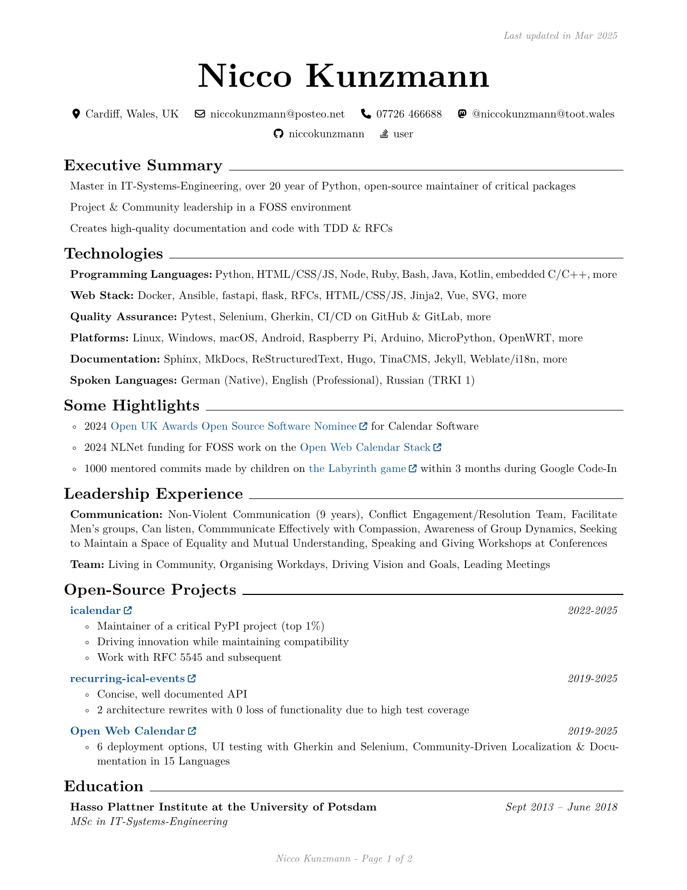

# Hire my skills as a High Quality Python Programmer

Dear Recruiter,

Are you looking for a team player that can take responsibility, lead a team in areas of expertise and makes sure your business delivers high quality solutions to clients that are stable AND flexible?
You found me!

I am looking for a job in which I work together with people - either in a team or on projects - to create high-quality software that exceeds business goals. Innovation and quality is important for me. I am motivated by solving hard problems that make your company stand out from others. My solutions are easy to maintain as well as flexible to future adaptations.

I am a Senior Python Fullstack Developer for the Cloud or in-house. My experience encompasses a range of programming languages and frameworks. While I excel in Python, I am looking for a place where I can grow my skills where it is needed to scale up.

If you are interested. Please get in contact!

---

You can find my **CV** below.

### [PDF](Nicco_Kunzmann_CV.pdf)

